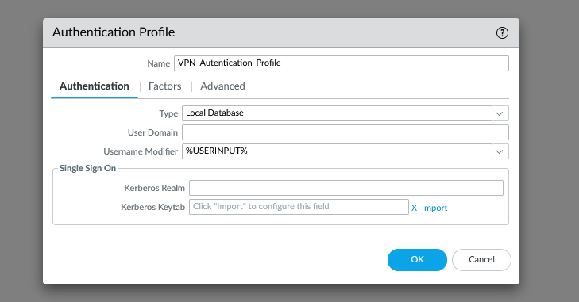
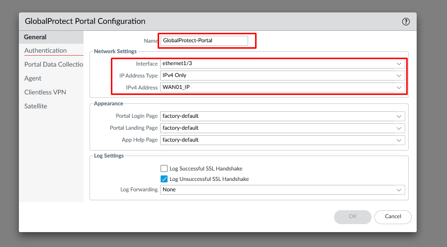

# Configuración Básica de Global Protect On-Demand

Esta configuracción de Global Protect es la mas habitual y como su nombre indica se aplica bajo demanda (cunado el usuario quiera). El usuario cuenta con el control sobre cuando conectarse o desconectarse de Global Protect. Esto provoca que cuando el usuario esta conectado a GlobalProtect le aparecera la opeción de "Desconectarse" cuando lo considere necesario.

En este articulo detallo paso a paso como implementar y configurar esta modalidad de Global Protect.

## Prerequistiros

## Antecedentes

## Vamos Paso A Paso

### Perfil de certificado
1. Generearemos una CA raíz, una CA intermedia y un Certificado de servidor. De esta dorma contaremos con una ruta de certificación completa.
   
  * **Generacción de los certificados en el Firewall**: Existen muchas opciones diferentes para poder implementar los certificados, no obstante en esta documentacción se ha decido optar por utilizar los certificados auto generados para poder desarollar la estructura de certificación y cifrado de las comunicaciones.
  
    * **Generación del certificado Root:** Devemos de generar un certifcado Raiz con un nombre de comun de cualquier valor unico, esto hace referencia a que sea utilizado para la generación de este IP o FQDN del portal o puerta de enlace.
    
   
    
   * **Generación del certificado Intermedio**: Esta opción no es obligatoria pero es recomendable como Best Practices para poder mantener una estrucutra de 3 nivles. Devemos generar un certificado intermedio firamdo por el certificado raiz anterior, especificado un nombre común como valor unico que como en el punto anterior no sea la IP o el FQDN del portal o puerta de enlace.

   

   * **Generar el certificado de servidore**: Debemos generar el certificado firlado por la CA intermedia, donde los datos deberan de coincidr estricatmetne con la IP o el FQDN del Portal y la puerta de enlace. 
      * **A**: Si el nombre "subj alt name(SAN)" no existira en el certificado. En los firewalls podemos crear estos atributos debajo de los atriburtos obligatorios. Añadiendo 'HostName', IP, 'e-mail', etc. 
      * **B**: Si los atributos SAN existen para poder determinar una entrad, entonces la IP o el FQDN que se utilizara para el portal debera de estar peresente en esta lista de registros.
      * **C**: Este certificado nunca deberia de ser una CA por motivos de seguridad y operativa.
      * **D**: Siempre que sea possible debera de utilizare el FQDN en lugar de la dirección IP.

 

### Perfil de Autenticación

4. Crea un perfil de autenticación a partir de **Device > Authentication Profile > Add**.
   * **Nombre:** Establecemos el nombre que va ha tener el perfil de autenticación.
   * **Type:** Escogemos a partir de que funete de datos vamos a absorver la identidad de los usuarios que vamos a utilizar en la VPN.
   * Para finbalizar devemos acceder al apartado **Advanced** donde definiremos el alacance de los usuarios que podran inicar sessión en la VPN, en el caso que nos ocupa para esta prueba de laboratorio utilizaremos el grupo **all**, en caso de necesitar limitarse se podria añadir cualquier otro grupo.

 
 

### Configuracción de interficies
5. Crearemos una nueva Zona para poder establezer el perfil de seguridad adecuado a partir de **Network > Zones** y crearemos una nueva zona con el nombre **Zone_VPN** sin inteficeies como miembro.

 

6. Crearemos la interfice del tunel a partir de **Network > Interfaces > Tunnel** y pulsmos en el boton **add**.
   *  **Comment:** Establecemos un nombre descriptivo para la utilizadad que se datra al tunel.
   *  **Tunel ID:** Establecemos el ID del tunel.
   *  **Virtual Route:** Establecemos el enrutado por defecto.
   *  **Security Zone:** Establecemos una zona, como buena practica se recomienda que exista una zona para los tuneles VPN ya que esto da una mayor flexibilidad para crear reglas de seguridad separadas.

 

### Configurar el portal de Global Protect
7. Crearemos el portal de la VPN de Global Protect a partir de **Network > GlobalProtect > Portals** y haremos clic a  **Add**.
   *  **Name:** Estableceremos el nombre descriptibo que tendra el portal, esta propiedad es meramente estetica.
   *  **Interface:** Estableceremos a partir de interfice se estara publicando el portal.
   *  **IP Address Type:** Establecermos IPv4 como direcciónmaiento que sera utilizado.
   *  **IPv4 Address:** Establemeos la Dirección IPv4 a traves de la que operara el portal.

 
 
 8. Nos desplazaremos a la pestaña de **Autenticatión**.
   *  **Server Autentication:** Establecemos el perfil de certificado que se va ha utilizar en el portal.
   *  **Client Autenticatión:** Hamreos clic en el boton **add** y estableceremos un nombre para este 
      * **Nombre**: Establecemos un nombre para el objeto.
      * **OS**: Establecmeos para que sistema operativo ara referencia.
      * **Autentication Profile:** Seleciónamos el perfil que hemos creado con anterioridad.
      * Una vez realizados los pasos anteriores haremos clic en el boton **OK**.

 

 9. Nos desplazaremos a la pestaña de **Agent**.
   *  Al ser una nueva instalción no existe la configuracción de agente y esta debera de ser creada de 0 y devmos de pulsar sobnre el boton **Add**.
      *  **Nombe:**  Establecemos un nombre descriptibo para esta configuración.
      *  **client Certifcate:** Dejaremos este partado vació ta que se utiliza solo en el caso de queramos dar un certificado a los clientes para poder conectarse.
      *  **Save User Credentials:** En caso de que aceptemos que se almacenen las credenciales de los usuarios, por defecto es YES.
      *  **Authentication Override:** Esta cookie se puede cifrar / descifrar utilizando cualquier certificado que se seleccione en el menú desplegable 'Certificado para cifrar / descifrar cookie ' y seleciónamos como certifcado el RootCA.
 
  
  
10. Dentro del apartado **Agent** buscamos las sección **Config Selection Criteria** y nos aseguramos que el aparado **SO** este en Any y el aparto user tambien, esto permite restringir el portal a gupos de usuarios en caso de ser necesario

  

12. Nos desplazamos a la prestaña **External**. Hacemos clic en **Add** el apartado **External Gateway**.

   *  **Name:** Establecemos en nombre del Gateway.
   *  **Address:** Establecemos el FQDN o Dirección IP que hemos creado para el portal en los puntos anteriroes
   *  **Source Region:** Estableceremos un any.

  
 
13. Nos desplazamos a la pestaña **App**.
   *  **Connect Method:** Establecemos como valor ""On-Demand""
   
  
  
14. En "CA raíz de confianza", seleccione la CA raíz y la CA intermedia. Además, seleccione 'Instalar en el almacén de certificados raíz local' para instalar estos certificados en el almacén de certificados raíz local del cliente después de que el cliente se conecte con éxito al portal por primera vez.

  

### Configurar del Gateway de GlobalProtect

15.   Nos desplazamos a **Network>GlobalProtect>Gateways>Add**
   *  Go to Device > GlobalProtect Client  and click on 'Check Now' to review for the latest GlobalProtect Agent software
   *  Click on 'Download' to download the selected agent software image
   *  At this point, the users will NOT be able to download the software image from the portal
   *  The downloaded software image has to be activated (click on 'Activate') in order for the users to be able to download from the portal

### Instalcción del agente

# Bibliografia 
CONFIGURACIÓN DE CERTIFICADO PARA GLOBALPROTECT - (SSL / TLS, PERFILES DE CERTIFICADO DE CLIENTE, CERTIFICADO DE CLIENTE / MÁQUINA)
* https://knowledgebase.paloaltonetworks.com/KCSArticleDetail?id=kA10g000000ClFoCAK

CONFIGURACIÓN BÁSICA DE GLOBALPROTECT CON ON-DEMAND
* https://knowledgebase.paloaltonetworks.com/KCSArticleDetail?id=kA10g000000ClH2CAK
